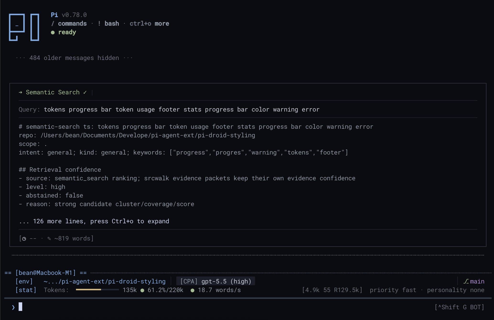

# pi-droid-styling

Opinionated Pi UI styling extension: compact startup UI, boxed editor, cleaner tool tags, message prefixes, footer stats, and reload-safe render patches.

## Screenshot



## Install

```sh
pi install git:github.com/sting8k/pi-droid-styling
```

For project-local install:

```sh
pi install -l git:github.com/sting8k/pi-droid-styling
```

## Features

- Compact startup header and loaded resources table.
- Boxed editor with selectable `userZoneStyle` presets and adjusted TUI padding.
- Cleaner assistant/user message spacing and prefixes.
- Compact tool tags with badges, elapsed time, and dimmed output support.
- Footer stats including token speed and compact session context.
- Optional true fixed user zone that keeps status/widgets/editor/footer at the bottom while chat/feed scrolls above, with mouse selection/copy support, themed bottom-row feedback, and OSC 52 clipboard propagation for terminal proxies.
- Reload/session-safe patches to avoid stacked padding or spacing.

## Config

Config is stored at `~/.pi/agent/pi-droid-styling.json`:

```json
{
  "alwaysExpanded": false,
  "maxExpandedLines": 50,
  "dimToolOutput": false,
  "customWorkingMessage": {
    "working": "Working",
    "thinking": "Thinking",
    "answering": "Answering",
    "running": "Cooking"
  },
  "userZoneStyle": "gemini",
  "inputBox": {
    "style": "auto"
  },
  "tasksWidgetStyle": "compact",
  "fixedUserZone": false,
  "forceOSC11": false
}
```

| Key | Type | Default | Description |
| --- | --- | --- | --- |
| `alwaysExpanded` | `bool` | `false` | Initial tool-output expansion state. Pi core `Ctrl+O` stays authoritative after that. |
| `customWorkingMessage` | `object` | `{"working":"Working", ...}` | Custom labels for the working/thinking/answering/running loader. Accepts partial objects; legacy `true`/`false` auto-normalizes. |
| `userZoneStyle` | `"gemini"` \| `"droid"` \| `"cli-dock"` | `"gemini"` | Input-zone preset. `gemini` = compact header/divider/status/halfblock-input/footer layout. `droid` = boxed legacy layout. `cli-dock` = opt-in Droid CLI-style bottom dock with a true outlined `›` prompt box, placeholder, model/context/branch/project status on the left, and MCP/footer status on the right. |
| `inputBox.style` | `"auto"` \| `"halfblock"` \| `"line"` \| `"solid"` | `"auto"` | Input-frame override. `auto` = preset default (gemini uses halfblock, droid uses its native boxed layout). `solid` uses selected-background input plus a bottom padding row without half-block glyphs for terminals with `▀`/`▄` seams. `cli-dock` intentionally keeps its outline box even if this is set to `line`. |
| `fixedUserZone` | `bool` | `false` | When enabled, status/widgets/editor/footer stay fixed at the bottom while chat/feed scrolls above. |
| `tasksWidgetStyle` | `"default"` \| `"compact"` | `"compact"` | Tasks sidebar widget style. `compact` = one-line summary `● Tasks › [N] <current task> · <time> (x/y done · n running)` with `idle`/`done`/blocked variants; current-task text is truncated to fit while counts are preserved. `default` = do not patch `pi-tasks`; leave the upstream widget untouched. Auto-scaffolded into the config file on first load. |
| `forceOSC11` | `bool` | `false` | Enable OSC 11 terminal background sync on Windows/WSL (off by default). |

## Profiling

Render profiling is disabled by default. To capture render/update/git/sidebar metrics plus memory, CPU delta, and event-loop utilization:

```sh
PI_DROID_PROFILE=1 PI_DROID_PROFILE_OUT=/tmp/pi-droid-profile.jsonl pi
```

Useful environment variables:

- `PI_DROID_PROFILE=1` enables profiling.
- `PI_DROID_PROFILE_OUT=/path/profile.jsonl` writes JSONL output. Use `stderr` or `stdout` for stream output.
- `PI_DROID_PROFILE_INTERVAL_MS=5000` controls summary cadence.

Synthetic self-check:

```sh
npm run profile:render
```

The synthetic bench exercises sidebar rendering, fixed-zone compositor repaint, render throttle, assistant/tool debounce, and git status refresh. Runtime terminal paint/GPU cost still needs a real Pi TUI capture.

## Notes

- Works with the active Pi theme; it paints TUI cells explicitly and uses OSC 11 terminal background sync on non-Windows hosts to cover terminal-owned padding/remainder areas. Windows/WSL/Windows Terminal skip OSC 11 unless `forceOSC11` is enabled.
- Compatible color schemes: https://github.com/sting8k/pi-themes
- `customWorkingMessage` is on by default. Set `working`, `thinking`, `answering`, and `running` strings to customize the themed loader labels.
- Existing legacy `customWorkingMessage: true` or `false` values are normalized back to the default label object.

## License

MIT
