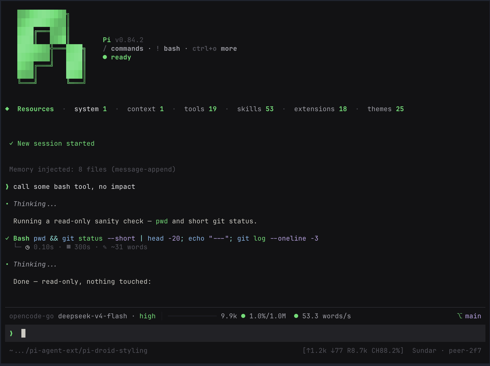

# pi-droid-styling

Opinionated Pi UI styling extension: compact startup UI, boxed editor, cleaner tool tags, message prefixes, footer stats, and reload-safe render patches.

## Screenshot



## Install

```sh
pi install npm:@sting8k/pi-droid-styling
```

Or install directly from Git:

```sh
pi install git:github.com/sting8k/pi-droid-styling
```

## Themes

This extension uses [`pi-themes`](https://github.com/sting8k/pi-themes) as its color layer. Installing `pi-droid-styling` automatically installs and registers those themes—no second install command is needed.

Already have `pi-themes` installed separately? Keep it. Existing themes take priority, and `pi-droid-styling` adds only the bundled themes that are missing—without duplicate-theme conflicts.

To install only the theme collection without this styling extension:

```sh
pi install git:github.com/sting8k/pi-themes
```

## Features

### Look and feel

- **A cleaner Pi, instantly.** Compact startup, a focused input editor, tidier conversations, collapsed tool output, and a footer that tracks your session.
- **Make it yours.** Two conversation layouts, three prompt styles, multiple input frames, and 25 themes included.

### Built for the terminal

- **Smoother while the model works.** Streaming text and fast tool updates are batched into steady frames instead of repainting on every token.
- **Stays aligned when you resize.** Boxes, labels, and right-aligned status account for terminal escape codes, so they wrap and truncate cleanly.
- **Long sessions stay fast.** Only the newest part of the chat is rendered, while huge tool results are capped so history does not slow you down.
- **Reloads stay clean.** UI patches are applied once and removed cleanly, so extension reloads and session switches do not stack layout changes.

## Config

Config is stored at `~/.pi/agent/pi-droid-styling.json`:

```json
{
  "alwaysExpanded": false,
  "maxExpandedLines": 50,
  "dimToolOutput": false,
  "customWorkingMessage": {
    "working": "Working",
    "thinking": "Thinking",
    "answering": "Answering",
    "running": "Cooking"
  },
  "presentationStyle": "droid",
  "userZoneStyle": "gemini",
  "inputBox": {
    "style": "auto"
  },
  "tasksWidgetStyle": "compact",
  "forceOSC11": false,
  "visibleChatTail": 30
}
```

| Setting | Options | Default | What it does |
| --- | --- | --- | --- |
| `alwaysExpanded` | `true`, `false` | `false` | Open tool output by default. `Ctrl+O` still toggles it. |
| `maxExpandedLines` | `0`–`1000` | `50` | Limit expanded tool output. Use `0` for no limit. |
| `dimToolOutput` | `true`, `false` | `false` | Dim tool output so the conversation stands out. |
| `customWorkingMessage` | Custom text | See example | Rename the working, thinking, answering, and tool-running labels. You can set only the ones you want to change. |
| `presentationStyle` | `droid`, `reasonix` | `droid` | `droid` keeps cards and tool boxes. `reasonix` uses a cleaner, compact conversation layout. |
| `userZoneStyle` | `gemini`, `droid`, `cli-dock` | `gemini` | Choose the look of the prompt, status rows, and footer. |
| `inputBox.style` | `auto`, `halfblock`, `line`, `solid` | `auto` | Choose the input-box frame. `auto` uses the best match for the selected user-zone style. |
| `tasksWidgetStyle` | `compact`, `default` | `compact` | Use the one-line tasks widget, or leave the original `pi-tasks` widget unchanged. |
| `forceOSC11` | `true`, `false` | `false` | Force terminal background sync on Windows/WSL. Usually leave this off. |
| `visibleChatTail` | `0` or more | `30` | Render only the newest N chat items for speed. Use `0` to render everything. |

## Profiling

Render profiling is disabled by default. To capture render/update/git/sidebar metrics plus memory, CPU delta, and event-loop utilization:

```sh
PI_DROID_PROFILE=1 PI_DROID_PROFILE_OUT=/tmp/pi-droid-profile.jsonl pi
```

Useful environment variables:

- `PI_DROID_PROFILE=1` enables profiling.
- `PI_DROID_PROFILE_OUT=/path/profile.jsonl` writes JSONL output. Use `stderr` or `stdout` for stream output.
- `PI_DROID_PROFILE_INTERVAL_MS=5000` controls summary cadence.

Synthetic self-check:

```sh
npm run profile:render
```

The synthetic bench exercises footer/editor rendering, render throttle, assistant/tool debounce, and git status refresh. Runtime terminal paint/GPU cost still needs a real Pi TUI capture.

## Notes

- Works with the active Pi theme; it paints TUI cells explicitly and uses OSC 11 terminal background sync on non-Windows hosts to cover terminal-owned padding/remainder areas. Windows/WSL/Windows Terminal skip OSC 11 unless `forceOSC11` is enabled.

- `customWorkingMessage` is on by default. Set `working`, `thinking`, `answering`, and `running` strings to customize the themed loader labels.
- Existing legacy `customWorkingMessage: true` or `false` values are normalized back to the default label object.

## Credits

The gradient startup header was inspired by [EnderLiquid/pi-startup-header](https://github.com/EnderLiquid/pi-startup-header).

## License

MIT
